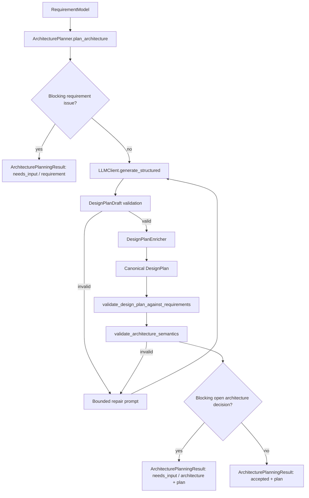

# Architecture Planner v0.1

Milestone 4 introduces the application layer that turns a validated `RequirementModel` into a validated functional `DesignPlan`.

## Boundary

The planner owns functional architecture only:

```text
RequirementModel = engineering intent
DesignPlan = functional architecture
CircuitIR = future electrical implementation
```

It must not select components, manufacturers, part numbers, pins, nets, KiCad symbols, KiCad footprints, SPICE models, resistor values, capacitor values, or PCB implementation details.

## Flow



## Draft Contract

`DesignPlanDraft` is the LLM-facing contract. It uses temporary local references so the LLM can express relationships without owning canonical identity.

Examples:

- `b_converter`
- `vin_protected`
- `i2c_bus`
- `d_power_topology`
- `TPS54331`
- `GPIO21`

These values are temporary references only. They may be arbitrary LLM labels and must never become canonical identity.

The draft contract is strict:

- Extra fields are forbidden.
- Duplicate draft IDs are rejected.
- Dangling block, port, power-domain, interface, connection, and decision references are rejected.
- `topology_class`, architecture decisions, and open-decision options use controlled architecture enums.
- Component-like leakage in structured fields is rejected by enum validation.

## Deterministic Enrichment

`DesignPlanEnricher` converts draft refs to canonical IDs through an internal temporary-reference map, copies source requirement linkage, assigns metadata, and validates the resulting plan. Canonical IDs do not sanitize, append, or otherwise derive from draft IDs or LLM wording.

Canonical examples:

- `DPLAN_0001`
- `BLOCK_PWR_001`
- `PORT_PWR_001`
- `PWRDOM_001`
- `IF_I2C_001`
- `CONN_001`
- `MAP_001`
- `DEC_001`

Canonical planner-owned text is also deterministic. Draft prose may help the LLM describe its proposal, but raw LLM block names, purposes, connection descriptions, power-domain names, interface names, decision rationales, assumptions, and open-decision descriptions are not copied unchanged into canonical `DesignPlan` state. The enricher generates architecture-level text from structured fields such as block type, topology class, interface type, power-domain role, architecture choice, and mapped requirements.

On replanning, the enricher preserves:

- `design_plan_id`
- incremented revision
- source requirement revision
- existing block IDs where block type and name still match
- existing interface IDs where interface type still matches
- existing port IDs where block identity and port name still match

The previous `RequirementModel` and previous `DesignPlan` are not mutated.

## Missing Input Semantics

Missing WHAT belongs to requirements:

- Blocking `RequirementModel.open_questions` return `needs_input`.
- A model with no active hard requirements returns `needs_input`.
- The planner does not mutate `RequirementModel` to invent answers.

Missing HOW belongs to architecture:

- Non-blocking `DesignPlan.open_decisions` can still return `accepted`.
- Blocking open architecture decisions return `needs_input` with the enriched plan attached.

## Validation

Every accepted plan must pass:

- Pydantic `DesignPlan` validation for internal references and controlled vocabularies.
- `validate_design_plan_against_requirements(...)` for source linkage and active hard requirement disposition.
- `validate_architecture_semantics(...)` for direct RequirementModel-to-DesignPlan semantic consistency.

Active hard requirements include confirmed, candidate, needs-clarification, and derived hard requirements. Rejected and superseded hard requirements do not force coverage. Valid dispositions are `mapped`, `partially_mapped`, `unresolved`, and `not_applicable`.

Milestone 4 semantic validation is intentionally small. It currently checks only facts explicitly represented in both contracts:

- mapped power-domain voltage consistency for exact, nominal, range, minimum, and maximum voltage constraints
- mapped interface protocol consistency for supported protocol enums such as `i2c`, `spi`, `uart`, `can`, and `usb`

Semantic consistency is not electrical verification. It does not prove load current capability, converter feasibility, tolerance behavior, thermal behavior, signal integrity, pull-ups, termination, or component suitability. Those remain deferred to later verification and implementation milestones.

Semantic mismatches are treated as invalid planner output and can trigger the bounded repair loop. If repair attempts are exhausted, the planner returns a typed `failed` result rather than accepting a contradictory `DesignPlan`.

## LLM Usage

The planner reuses the existing `LLMClient.generate_structured(...)` interface. Tests use fake LLM clients only. The local Ollama `qwen-coder` model can be used by wiring the existing Ollama client into `ArchitecturePlanner`; the planner itself does not depend on Ollama.
